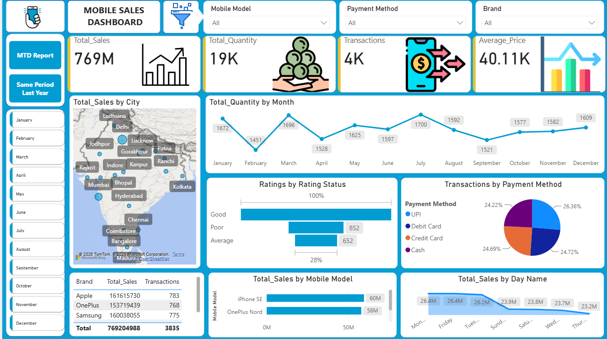

# 📱 Mobile Sales Dashboard (Power BI)

An interactive Power BI dashboard analyzing mobile phone sales data — covering revenue trends, brand performance, payment methods, and year-over-year comparisons.

## 📊 Key Metrics
- **Total Sales:** 769M
- **Total Quantity:** 19K units
- **Transactions:** 4K
- **Average Price:** 40.11K

## 🔍 Features
- **Filters:** Mobile Model, Payment Method, Brand, Year/Quarter/Month/Day
- **Total Sales by City** — geographic sales distribution (map view)
- **Total Quantity by Month** — monthly sales trend
- **Ratings by Rating Status** — Good / Average / Poor breakdown
- **Transactions by Payment Method** — UPI, Debit Card, Credit Card, Cash split
- **Total Sales by Mobile Model** — model-wise revenue comparison
- **Total Sales by Day Name** — day-of-week sales pattern
- **Brand-wise summary table** — Apple, OnePlus, Samsung sales & transactions
- **MTD (Month-to-Date) Report** — cumulative sales tracking by Year/Quarter/Month/Day
- **Same Period Last Year** — YoY comparison by Year, Quarter, and Month

## 🛠️ Tools Used
- Power BI Desktop
- Power Query (data cleaning & transformation)
- DAX (calculated measures — MTD, Same Period Last Year, etc.)

## 📷 Dashboard Preview

### Main Dashboard

### MTD Report

### Same Period Last Year

## 📁 Files
- `MS_Dashboard_-.pbix` — Power BI source file (open with Power BI Desktop to explore live)
